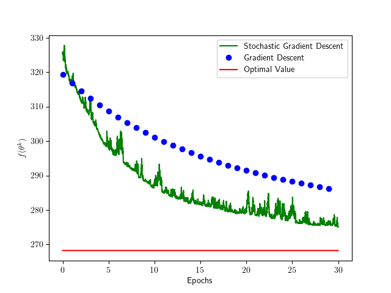
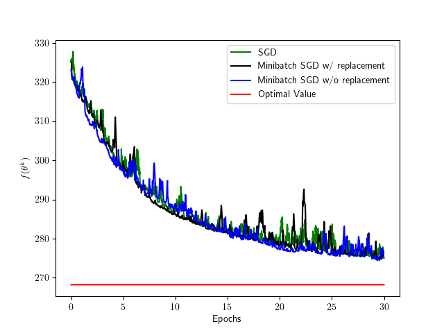
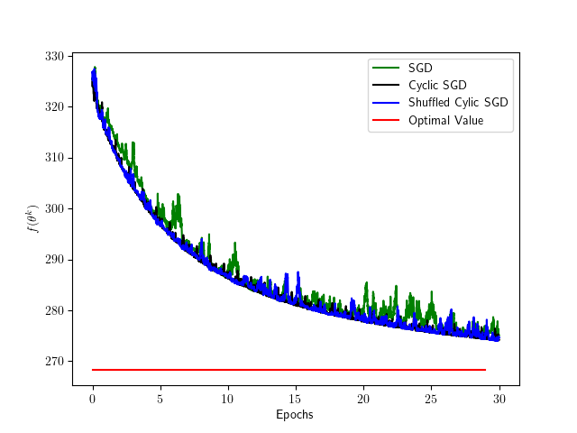

# Examples of GD and SGD

For the least squares problem

$$
\underset{\theta \in \mathbb{R}^{p}}{\mathrm{minimize}} \frac{1}{2N}\|X\theta-Y\|^2
$$

where $X\in \mathbb{R}^{N\times p}$ and $Y\in \mathbb{R}^N$.

- Optimal solution : 

$$
\theta^{\star}=\left(X^{\top} X\right)^{-1} X^{\top} Y
$$

- Gradient descent (GD) :

$$
\theta^{k+1}=\theta^k-\frac{\alpha}{N} X^T(X\theta^k-Y)
$$

- Stochastic gradient descent (SGD) :

$$
\begin{align*}
i(k)\sim \mathrm{Uniform}(\{1,\dots,N\}) \\
\theta^{k+1}=\theta^k-\alpha (X_{i(k)}^\intercal \theta^k-Y_{i(k)})X_{i(k)}
\end{align*}
$$

- Minibatch SGD with Replacement : 

$$
\begin{align*}
i(k, 1), \ldots, i(k, B) \sim \mathrm{Uniform}(\{1,\dots,N\}) \\
\theta^{k+1}=\theta^{k}-\frac{\alpha}{B} \sum_{b=1}^{B} (X_{i(k, b)}^\intercal \theta^k-Y_{i(k, b)})X_{i(k, b)}
\end{align*}
$$

- Minibatch SGD without Replacement : 

$$
\begin{align*}
\sigma^{k} \sim \mathrm{permutation}(N) \\
\theta^{k+1}=\theta^{k}-\frac{\alpha}{B} \sum_{b=1}^{B} (X_{\sigma^{k}(b)}^\intercal \theta^k-Y_{\sigma^{k}(b)})X_{\sigma^{k}(b)}
\end{align*}
$$

- Cyclic SGD : 

$$
\begin{align*}
f(k) = \bmod (k, N)+1 \\
f(k)\_{k=0,1, \ldots} = 1,2, \ldots, N, 1,2, \ldots, N, \ldots \\
\theta^{k+1}=\theta^k-\alpha (X_{f(k)}^\intercal \theta^k-Y_{f(k)})X_{f(k)}
\end{align*}
$$

- Shuffled Cyclic SGD : 

$$
\begin{align*}
f(k) = \bmod (k, N)+1 \\
f(k)\_{k=0,1, \ldots} = 1,2, \ldots, N, 1,2, \ldots, N, \ldots \\
\sigma^{0}, \sigma^{1}, \ldots \text {is a sequence of random permutations.} \\
\theta^{k+1}=\theta^k-\alpha (X_{\sigma^{\left \lfloor \frac{k}{N} \right \rfloor}(f(k))}^\intercal \theta^k-Y_{\sigma^{\left \lfloor \frac{k}{N} \right \rfloor}(f(k))})X_{\sigma^{\left \lfloor \frac{k}{N} \right \rfloor}(f(k))}
\end{align*}
$$

---

- `N` : Number of data
- `p` : Size of dimension
- `K` : Number of epochs
- `B` : Size of minibatch

## [`1.1.py`](1.1.py)

Compares GD with SGD.

Note that 1 iteration of GD constitutes an epoch, while $N$ iterations of SGD constitutes an epoch.

## [`1.2.py`](1.2.py)

Compares SGD with minibatch SGD with/without replacement.

Note that $N$ iteration of SGD constitutes an epoch, while $N / B$ iterations of minibatch SGD constitutes an epoch.

## [`1.3.py`](1.3.py)

Compares SGD with cyclic SGD and shuffled cyclic SGD.

