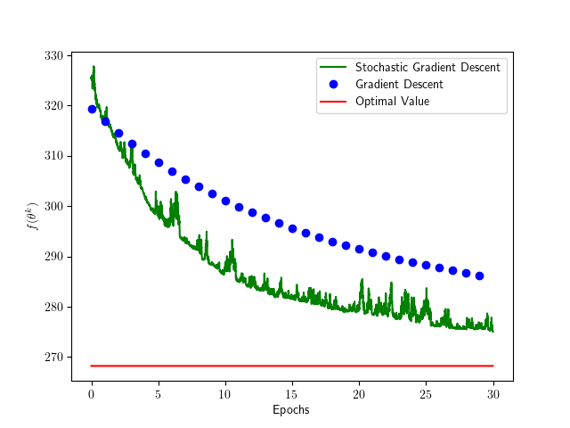
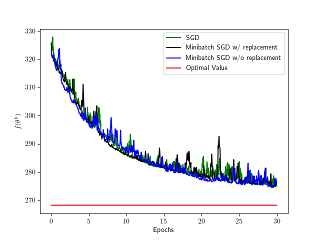
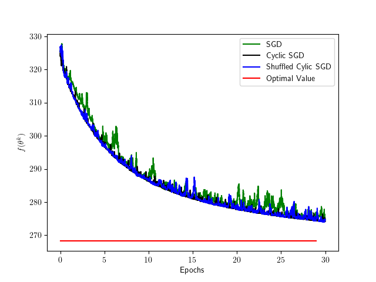

# Example of GD and SGD

For the least squares problem

$$
\begin{array}{ll}
\underset{\theta \in \mathbb{R}^{p}}{\operatorname{minimize}} \frac{1}{2N}\|X\theta-Y\|^2
\end{array}
$$

where $X\in \mathbb{R}^{N\times p}$ and $Y\in \mathbb{R}^N$.

Optimal solution is 

$$
\theta^{\star}=\left(X^{\top} X\right)^{-1} X^{\top} Y
$$

Gradient descent (GD) becomes

$$
\theta^{k+1}=\theta^k-\frac{\alpha}{N} X^T(X\theta^k-Y)
$$

Stochastic gradient descent (SGD) becomes

$$
i(k)\sim \mathrm{Uniform}(\{1,\dots,N\})\\
\theta^{k+1}=\theta^k-\alpha (X_{i(k)}^\intercal \theta^k-Y_{i(k)})X_{i(k)}
$$

---

- `N` : Number of data
- `p` : Size of dimension
- `K` : Number of epochs
- `B` : Size of minibatch

## 1.1.py

Compares GD with SGD.

Note that 1 iteration of GD constitutes an epoch, while $N$ iterations of SGD constitutes an epoch.

## 1.2.py

Compares SGD with minibatch SGD with/without replacement.

Note that $N$ iteration of SGD constitutes an epoch, while $N / B$ iterations of minibatch SGD constitutes an epoch.

## 1.3.py

Compares SGD with cyclic SGD and shuffled cyclic SGD.

